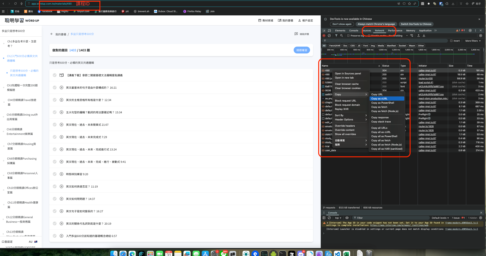

# WordUpClassReset
重置 Wordup 課程狀態

***

# WordUp 課程一鍵重置工具 🚀

## 簡介
因為 WordUp 官方無意推出重置課程學習進度功能，但是手動一個一個清除又很麻煩...
所以就搞了一個這個工具
這個工具可讓你快速、批次【重置】WordUp 單一課程下所有學習進度，**只要貼上 Chrome DevTools Copy as cURL 指令，一鍵完成！**
完全無需安裝 Python、不需搞伺服器，所有認證及資料都只會在你自己的瀏覽器與 Google Colab 內操作，**安全又隱私友善**。

***

## 功能特色

- 支援任何 WordUp 課程（materials/課程id）
- 完全雲端運作，免安裝/免權限
- 自動抓出所有章節/卡片，批次重置不漏掉任何 component
- token 與密鑰只在自己瀏覽器運算，絕對安全

***

## 使用教學

1. **進到你要重置的 WordUp 課程** 
例如網址含 `/materials/348` 的課程內容頁
2. **按下 F12 打開 Chrome 開發者工具，切換到 Network（網路）分頁**
3. **在網頁上任意操作，找到一筆材料頁（materials/課程id）的請求**
4. **右鍵該請求 → Copy as cURL（複製為 cURL 指令）**
[]
5. **點選本頁上方「在 Colab 執行」按鈕，開啟 notebook**
6. **在 Colab 內貼上第 4 步的 cURL 指令（建議貼到對話框/輸入區，結束按兩下 Enter）**
7. **依照畫面指示執行，一鍵完成該課程所有學習進度 reset！**

***

## 常見問題 FAQ

**Q1：這個工具會存我的 token/帳號嗎？**
A：完全不會。所有 cURL/token 都只在你個人 Colab 執行、Google 個人雲端，任何其他人（包括 repo 提供者）都無法取得。

**Q2：忘了章節ID要去哪裡找？**
A：只要 copy「該課程」的任何材料 API 請求 cURL，程式會自動幫你抓所有章節與 component。

**Q3：遇到 401/403 或 reset 部分失敗？**
A：請重新在 WordUp 登入、刷新頁面，再 copy一次 cURL headers（token 過期就會這樣）。

**Q4：可否自己下載、離線本地使用？**
A：本 notebook 完全可以 下載成 .ipynb，在你本機 Jupyter Lab/ VSCode 跑，唯一前提是要有 Python requests 套件。

***

## 開源協議

本工具出於公益學習、無商業用途。

***

## 聯絡/貢獻

- 作者：twjazzhuang
- 有任何意見歡迎 PR / issue 討論！

***

> **用這個工具，讓每個人都能簡單、安全、自由地掌控自己的學習狀態！**

